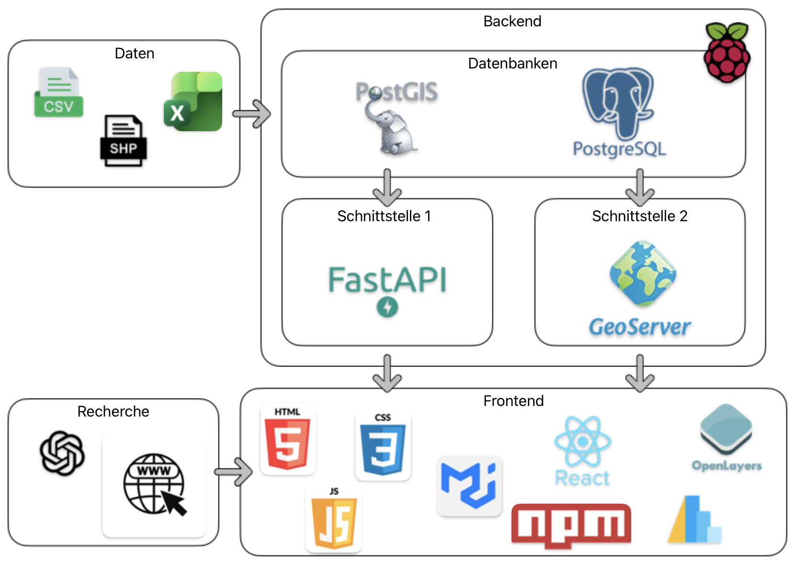

# Aufbau Geodateninfrastruktur
## Architektur
Die Geoinfrastruktur des Corona Dashboards besteht aus einem Backend und einem Frontend. Die folgende Visualisierung zeigt die Architektur des Corona Dashboard:

Bereiche:
- [Daten](./GDI_Daten)
- [Backend](./GDI_Backend)
- [Frontend](./GDI_Frontend)
- [Recherche](./GDI_Recherche)

