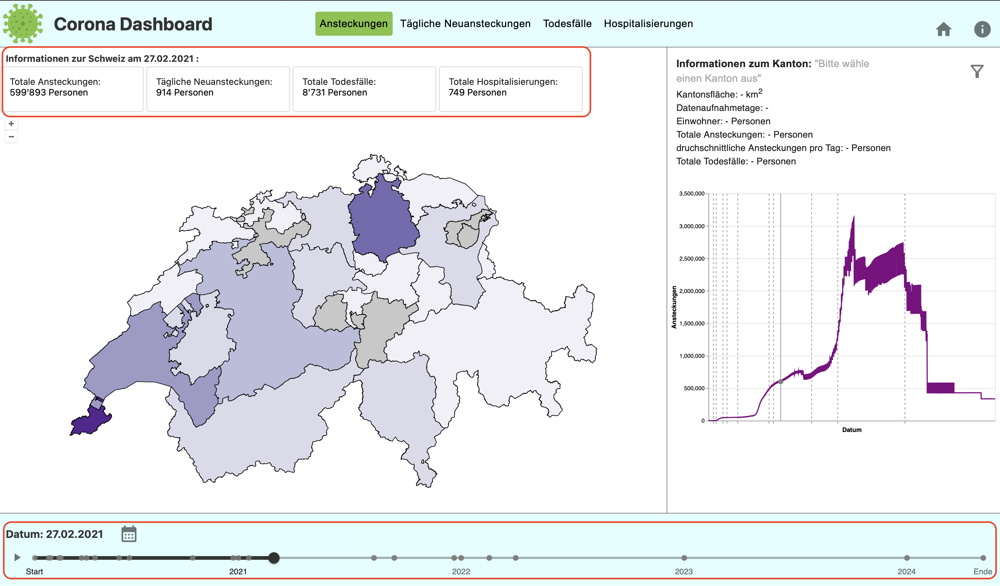
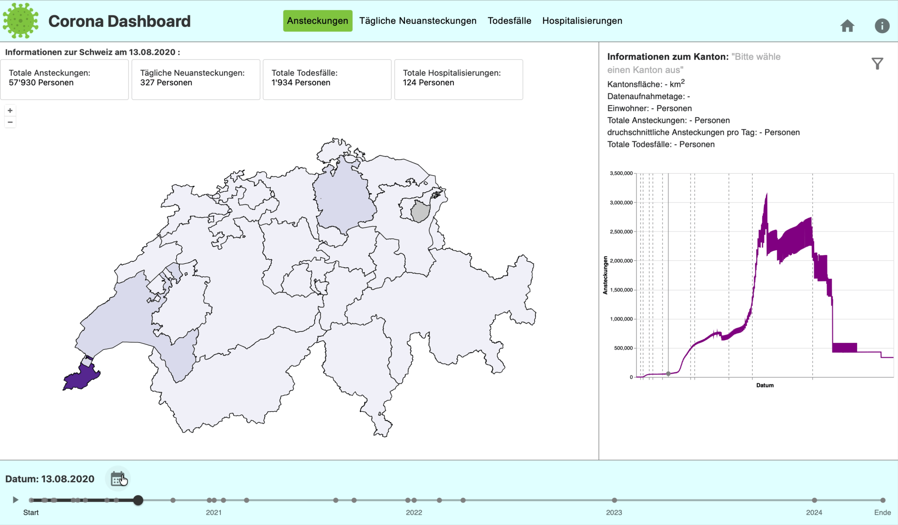
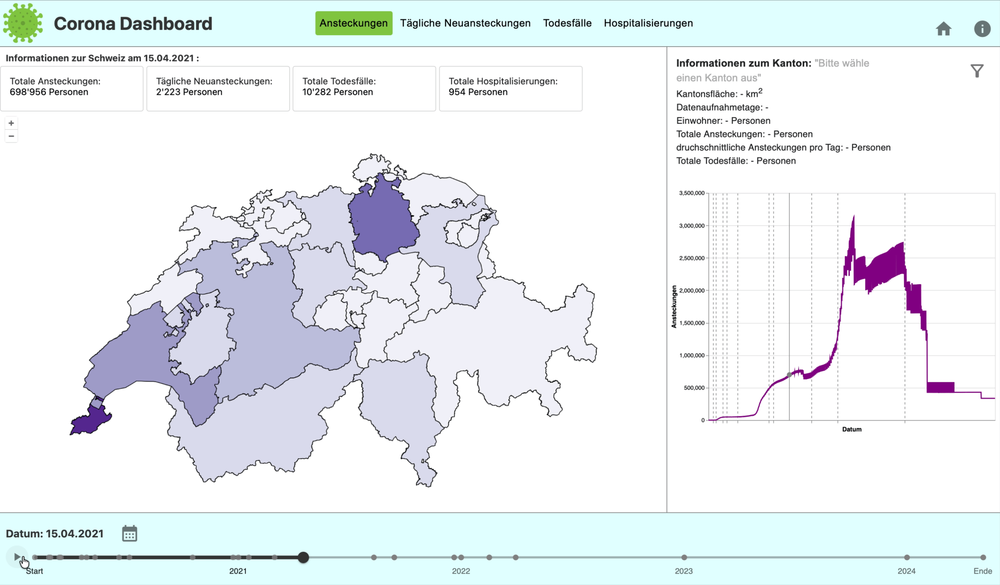
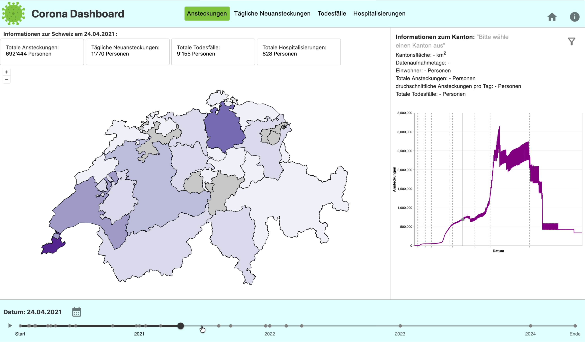
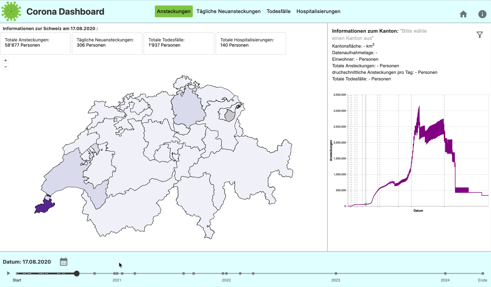

## Funktionen im Footer
Im Footer wird das aktuell ausgewählte Datum angezeigt. Die dargestellten Werte in der Karte entsprechen jeweils den Daten dieses Tages, beispielsweise den gemeldeten Fallzahlen.

Über das Kalendersymbol kann ein beliebiges Datum zwischen dem Beginn der Pandemie in der Schweiz am 01.02.2020 und dem Ende der Datenerfassung am 05.05.2024 ausgewählt werden.

Mit dem Playsymbol vor dem Slider kann die Zeitleiste automatisch abgespielt werden. Während sich der Slider bewegt, aktualisieren sich die Daten auf der Karte fortlaufend. Dadurch lässt sich der räumliche Verlauf der Pandemie im Zeitverlauf nachvollziehen.

Der Slider kann auch manuell bewegt werden, um ein bestimmtes Datum auszuwählen. 

Gleichzeitig dient er als Zeitstrahl: Graue Punkte markieren wichtige Beschlüsse und Massnahmen des Bundes während der Pandemie. Wird mit der Maus über einen dieser Punkte gefahren, erscheinen zusätzliche Informationen zum jeweiligen Ereignis.

