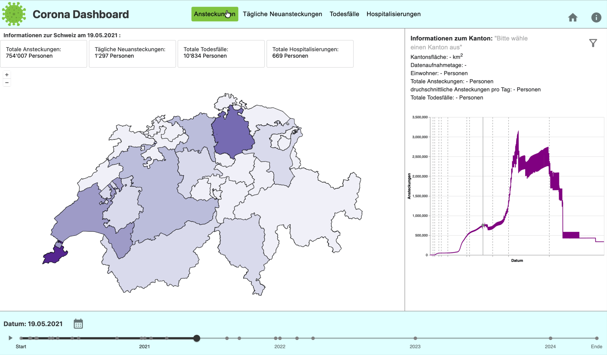

## Funktionen in der Karte
Die Karte zeigt alle Kantone der Schweiz sowie Liechtenstein. Je nach ausgewähltem Themenbereich werden die Kantone unterschiedlich eingefärbt.

Die Farbintensität richtet sich nach der Höhe des jeweiligen Wertes. Dafür wird der gesamte Wertebereich – vom kleinsten bis zum grössten Wert – berechnet und anschliessend in sechs gleich grosse Klassen unterteilt. Falls für ein bestimmtes Datum keine Daten für einen Kanton vorhanden sind, wird der entsprechende Kanton auf der Karte grau dargestellt.

Durch einen Klick auf einen Kanton kann dieser ausgewählt werden. Die Karte zoomt daraufhin auf den entsprechenden Bereich, und der ausgewählte Kanton wird hervorgehoben.

Wenn mit der Maus über einen Kanton gefahren wird, erscheint dessen Name als Hinweis auf der Karte.

