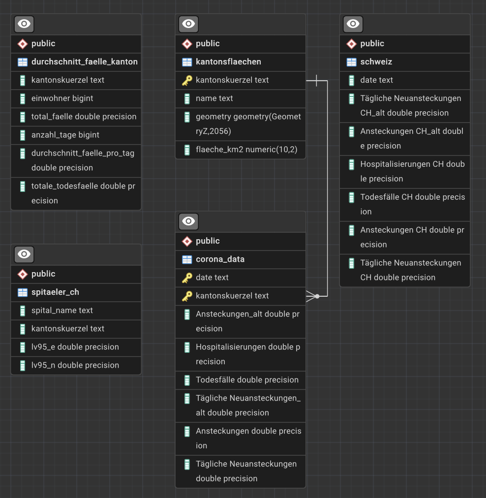

## Backend
Das Backend des Corona-Dashboards besteht aus PostgreSQL-/PostGIS-Datenbanken sowie den Schnittstellen FastAPI und GeoServer.
Die gesamte Backend-Infrastruktur wurde zunächst lokal auf einem Laptop entwickelt und anschliessend auf einen Raspberry Pi 5 übertragen.

### Datenbank
Die Daten werden in PostGIS-Datenbanken gespeichert und mit dem Programm pgAdmin 4 verwaltet. Sämtliche im Projekt verwendeten Daten sind in einzelnen Tabellen organisiert und bilden gemeinsam die Datenbank Corona_DB.
Die wichtigsten Tabellen des Projekts sind:
* corona_data: enthält die Coronadaten wie Ansteckungen, Todesfälle und Hospitalisierungen.
* durchschnitt_faelle_kanton: enthält die durchschnittlichen Fallzahlen pro Kanton.
* kantonsflaechen: enthält die Kantonsgeometrien sowie deren Flächen in km².
* schweiz: enthält die Kennzahlen für die gesamte Schweiz sowie Liechtenstein.

Die Beziehungen zwischen den Tabellen werden im folgenden Schema dargestellt:

Zusätzlich werden in der Datenbank weitere Kennzahlen berechnet, darunter tägliche Neuansteckungen, durchschnittliche Ansteckungen pro Tag sowie schweizweite Gesamtwerte.

#### Berechnungen
* Tägliche Ansteckungen:  
    Die täglichen Neuansteckungen werden aus dem Attribut ncumul_conf berechnet. Dazu wird die Anzahl der Fälle eines Tages mit jener des vorherigen Tages verglichen. Die Differenz ergibt die Anzahl neuer Fälle pro Tag.
    Falls für den vorherigen Tag kein Wert vorhanden ist, wird stattdessen der zuletzt verfügbare Datensatz mit einem gültigen Wert verwendet.

* Durchschnittliche Ansteckungen pro Tag:  
    Dieser Wert wird berechnet, indem die maximale Anzahl kumulierter Fälle (ncumul_conf am letzten Erfassungstag) durch die Anzahl der Datenerfassungstage dividiert wird.

* Schweizweite Kennzahlen:  
    Die Werte für die gesamte Schweiz – darunter Ansteckungen, Todesfälle, Hospitalisierungen und tägliche Neuansteckungen – ergeben sich aus der Summe der entsprechenden Werte aller Kantone für ein bestimmtes Datum.

### Schnittstellen (API / GeoServer)
Die Kommunikation zwischen Backend und Frontend erfolgt über FastAPI und GeoServer.
Die Kantonsflächen werden über den GeoServer als WMS-Dienst publiziert und anschliessend mit OpenLayers im Frontend dargestellt.
Alle weiteren Daten werden über FastAPI bereitgestellt. 

Dabei stehen mehrere API-Endpunkte zur Verfügung:

**/corona?kanton=${kanton}**  
* Lädt die Coronadaten eines bestimmten Kantons aus der Tabelle corona_data. Die Daten werden für das Diagramm in der Sidebar verwendet. Dabei werden sämtliche Attribute übertragen und abhängig vom ausgewählten Thema visualisiert.
Dieser Endpoint wird aufgerufen, sobald ein Kanton auf der Karte oder über den Filter ausgewählt wird.

**/corona-map?datum=${datum}**  
* Lädt die Coronadaten für ein bestimmtes Datum aus der Tabelle corona_data. Alle relevanten Attribute werden übertragen und entsprechend dem ausgewählten Thema dargestellt.
Der Endpoint wird ausgelöst, sobald der Slider abgespielt oder ein bestimmtes Datum ausgewählt wird.

**/schweiz?datum=${datum}**  
* Lädt die schweizweiten Coronadaten aus der Tabelle schweiz für ein bestimmtes Datum. Die Daten werden oberhalb der Karte angezeigt.
Dieser Endpoint wird beim Öffnen der Seite sowie bei jeder Änderung des Datums über den Slider oder Kalender aufgerufen.

**/schweiz-verlauf**  
* Lädt die Verlaufsdaten der gesamten Schweiz aus der Tabelle schweiz für das Diagramm. Die Abfrage ist unabhängig vom aktuell gewählten Datum.
Je nach ausgewähltem Thema werden die entsprechenden Werte dargestellt.
Der Endpoint wird direkt beim Laden der Seite ausgeführt.

**/flaechen?kanton=${kanton}**  
* Lädt das Attribut flaeche_km2 aus der Tabelle kantonsflaechen für die Anzeige in der Sidebar.
Der Endpoint wird aufgerufen, sobald ein Kanton ausgewählt wird.

**/durchschnitt?kanton=${kanton}**  
* Lädt sämtliche Attribute der Tabelle durchschnitt_faelle_kanton für die Sidebar.
Dieser Endpoint wird ebenfalls ausgelöst, sobald ein Kanton über die Karte oder den Filter ausgewählt wird.

Die Daten werden über GET-Anfragen vom Frontend abgerufen und anschliessend an die entsprechenden Komponenten der Benutzeroberfläche weitergegeben.