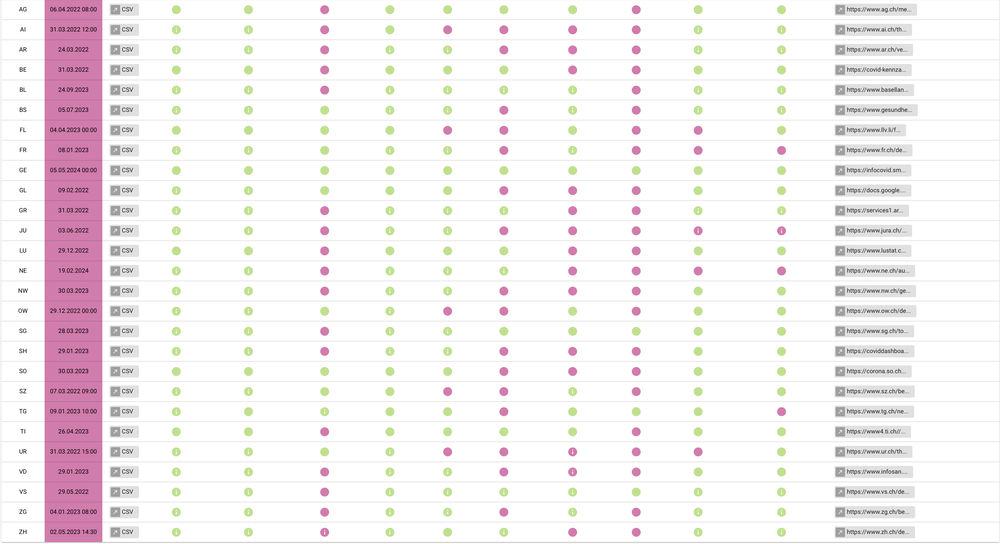
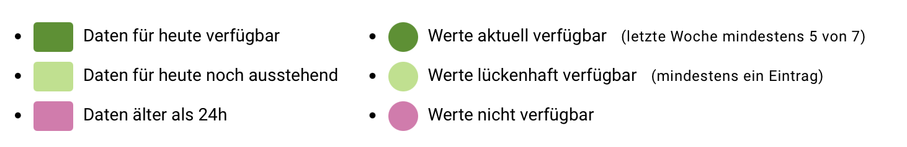

## Daten
### Corona - Daten:
Die Corona-Daten stammen aus einem GitHub-Repository, aus dem die Datensätze heruntergeladen werden können. Für jeden Kanton sowie für Liechtenstein liegt jeweils eine Datei im CSV-Format vor.
* Download Daten: [OpenZH COVID Repository](https://github.com/openZH/covid_19)

Die Datensätze enthalten verschiedene Attribute, darunter beispielsweise aktuelle Ansteckungen, Todesfälle und Hospitalisierungen. Nicht alle Attribute sind jedoch vollständig oder durchgehend vorhanden.

_Bildquelle: Das Bild kommt von der Seite des GitHub Repository. Allerdings funktioniert der Link zu der Visualisierung nicht mehr._

Für dieses Projekt wurden insbesondere folgende Attribute verwendet:
* ncumul_conf: kumulierte Ansteckungen
* ncumul_deceased: kumulierte Todesfälle
* current_hosp: aktuelle Hospitalisierungen
* sowie das Kantonskürzel, damit die Daten mit den anderen Daten verknüpft werden können

Leider sind nicht immer alle Werte vollständig vorhanden. Besonders an Wochenenden kann es zu Lücken in der Datenerfassung kommen, da nicht an allen Tagen gleich zuverlässig oder regelmässig gemeldet wurde.

#### Hinweis zu den Corona - Daten:
Die Daten enthalten ausschliesslich gemeldete Fälle. Die tatsächliche Anzahl infizierter Personen dürfte daher höher liegen. Gründe dafür können unter anderem sein, dass infizierte Personen keine Symptome hatten und deshalb nicht getestet wurden oder dass Fälle den zuständigen Behörden nicht gemeldet wurden.
Auch bei den Todesfällen kann nicht in jedem Fall eindeutig festgestellt werden, ob diese direkt auf eine Corona-Infektion zurückzuführen sind oder ob weitere Ursachen eine Rolle gespielt haben. Ähnliches gilt für die Hospitalisierungen, da nicht immer vollständig nachvollziehbar ist, nach welchen Kriterien die Daten erhoben wurden.
Die dargestellten Zahlen und Angaben sollten deshalb stets kritisch betrachtet und im entsprechenden Kontext interpretiert werden.

### Einwohnerzahlen:
Die Einwohnerzahlen werden vom Bundesamt für Statistik bezogen und in einer Excel-Tabelle gespeichert.
* Download Daten: [Einwohnerdaten BFS](https://dam-api.bfs.admin.ch/hub/api/dam/assets/36139705/master)

### Kantonsflächen:
Die Flächendaten der Kantone stammen von swisstopo, genauer aus dem Datensatz swissBOUNDARIES3D. Diese Geodaten liegen im Shapefile-Format vor.
* Download Daten: [swissBOUNDARIES3D](https://www.swisstopo.admin.ch/de/landschaftsmodell-swissboundaries3d)

Alle Daten werden anschliessend entweder mit dem Tool shp2pgsql von PostgreSQL/PostGIS oder über das Importwerkzeug von pgAdmin 4 in die Datenbank importiert. Nicht benötigte Attribute werden bereits vor dem Import entfernt.

Zusätzliche Attribute, die aus Berechnungen bestehender Daten entstehen, werden direkt in der Datenbank mithilfe von SQL erstellt und berechnet.