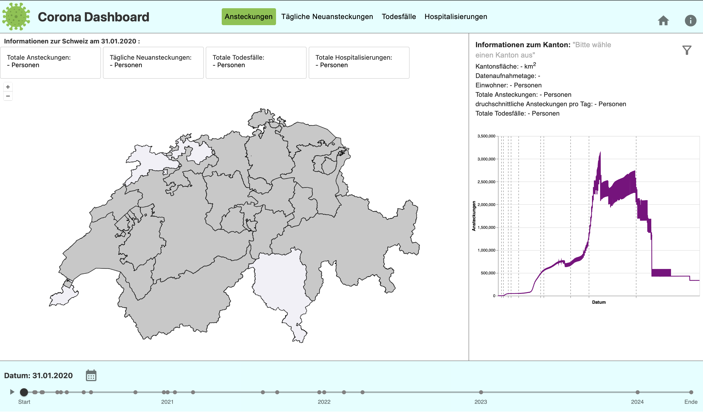

## Home
Willkommen auf der GitHub-Page des Corona-Dashboards.
Das Corona-Dashboard ist eine interaktive Webanwendung zur Visualisierung und Analyse der Corona-Pandemie in der Schweiz. Es bietet einen umfassenden Überblick über den Verlauf der Pandemie sowohl auf nationaler Ebene als auch für einzelne Kantone.
Die Daten werden übersichtlich in interaktiven Karten und verschiedenen Diagrammen dargestellt, wodurch Vergleiche zwischen den Kantonen einfach möglich sind. Zusätzlich fasst ein Zeitstrahl wichtige Ereignisse wie Lockdowns, Massnahmen und politische Beschlüsse chronologisch zusammen.

Projektteam:
* Aurelia Weickgenannt
* Pascal Schmid
